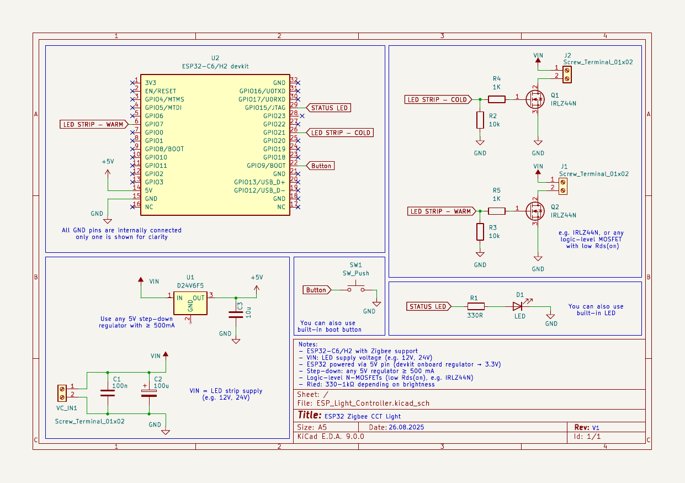
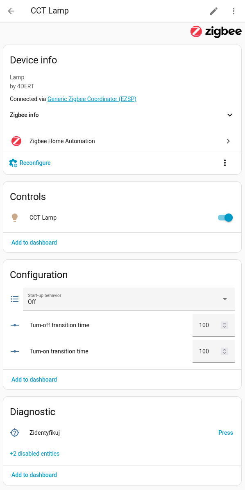
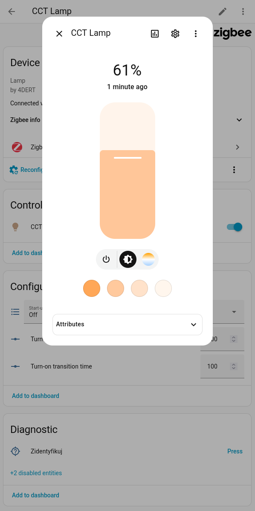
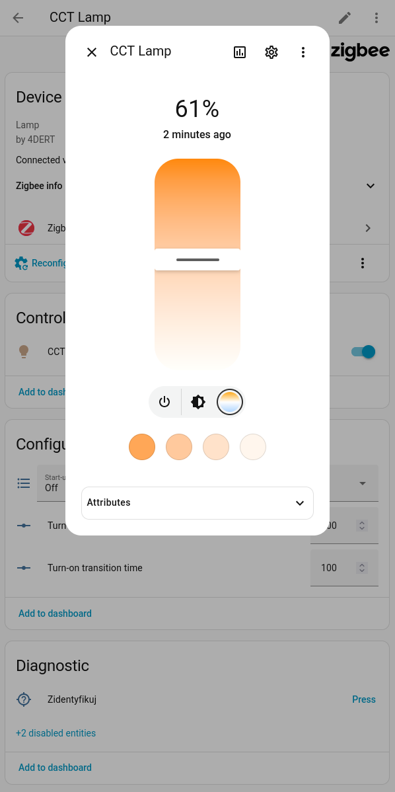

# ESP32 Zigbee CCT Light
**ESP32 Zigbee CCT Light** is an open-source firmware for **ESP32-C6** and **ESP32-H2** microcontrollers, turning them into a Zigbee tunable white (CCT) LED controller.  
It integrates seamlessly with **Home Assistant (ZHA)** and other Zigbee Home Automation coordinators.

## Features
- **Brightness control** – smooth dimming up and down.
- **Color temperature control** – via Zigbee *Color Control* cluster (mireds, warm <-> cool white).
- **Startup behavior** – choose whether the lamp should power up:
  - always ON,
  - always OFF,
  - or restore the last state.
- **Customizable transition times** – configure how fast the lamp fades when switching or changing parameters.
- **Local button support**:
  - single press – toggle ON/OFF,
  - double press – cycle through presets (different brightness/temperature combinations),
  - long press – factory reset.
- **Zigbee groups support** – control the light as part of a group, even without the coordinator.

## Zigbee Clusters
This device implements the following Zigbee Home Automation clusters (server role):

| Cluster         | Functionality                                                                 |
|-----------------|-------------------------------------------------------------------------------|
| **Basic**       | ZCL version, power source, manufacturer name (`4DERT`), model (`Lamp`), date code |
| **Identify**    | Identify mode support (used for pairing/diagnostics)                         |
| **Groups**      | Group addressing (ON/OFF, Level, Color Control)                              |
| **On/Off**      | Main power control, with `StartUpOnOff` attribute (restore last state / ON / OFF) |
| **Level Control** | Brightness control (`CurrentLevel`), on/off transition times                |
| **Color Control** | Color temperature control (mireds only); physical min/max limits            |

## Hardware
- **ESP32-C6** / **ESP32-H2** devkit or module (with Zigbee support).
- Two logic-level N-MOSFETs (e.g. IRLZ44N) controlling warm-white and cool-white LED channels.  
- Step-down regulator (VIN → 5V) to power the ESP32.  
- Optional push-button connected to a GPIO (for local control and factory reset) – you can also use the built-in BOOT button on the devkit.  
- Optional status LED with resistor connected to a GPIO – or use the built-in LED available on most devkits.  
- LED strips powered directly from VIN (e.g. 12V or 24V).  

Circuit diagram:



## Integration
- Tested with **Home Assistant (ZHA)**.
- Should also work with **Zigbee2MQTT** and other HA-profile compatible coordinators.

Screenshots from Home Assistant:





## Building & Flashing
1. Clone the repository and open it in **VS Code**.  
   A ready-to-use [Dev Container](https://code.visualstudio.com/docs/devcontainers/containers) is provided – once you open the project in VS Code with the *Dev Containers* extension, it will automatically pull an environment with **ESP-IDF**, Python tools, and dependencies preinstalled.  

2. If building locally, install [ESP-IDF](https://docs.espressif.com/projects/esp-idf/en/latest/esp32c6/get-started/).  

3. Select target:
    ```bash
    idf.py set-target esp32c6/esp32h2
    ```

4. Build, flash and monitor:
    ``` bash
    idf.py build flash monitor
    ```